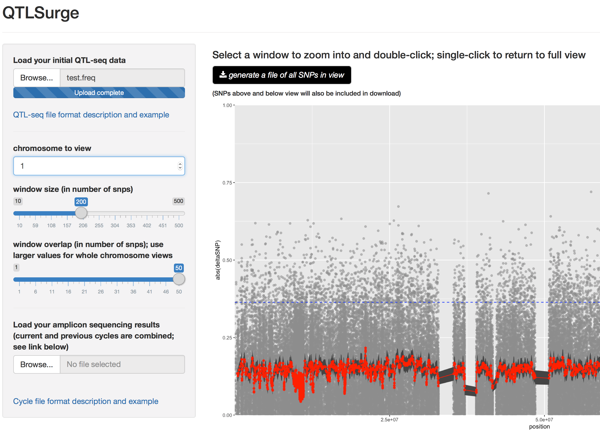
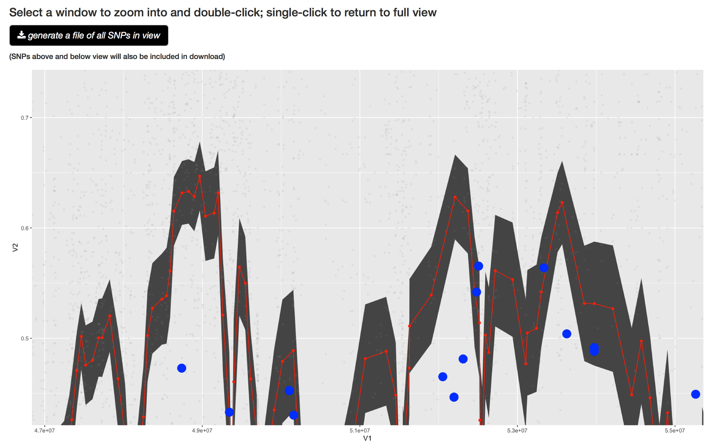
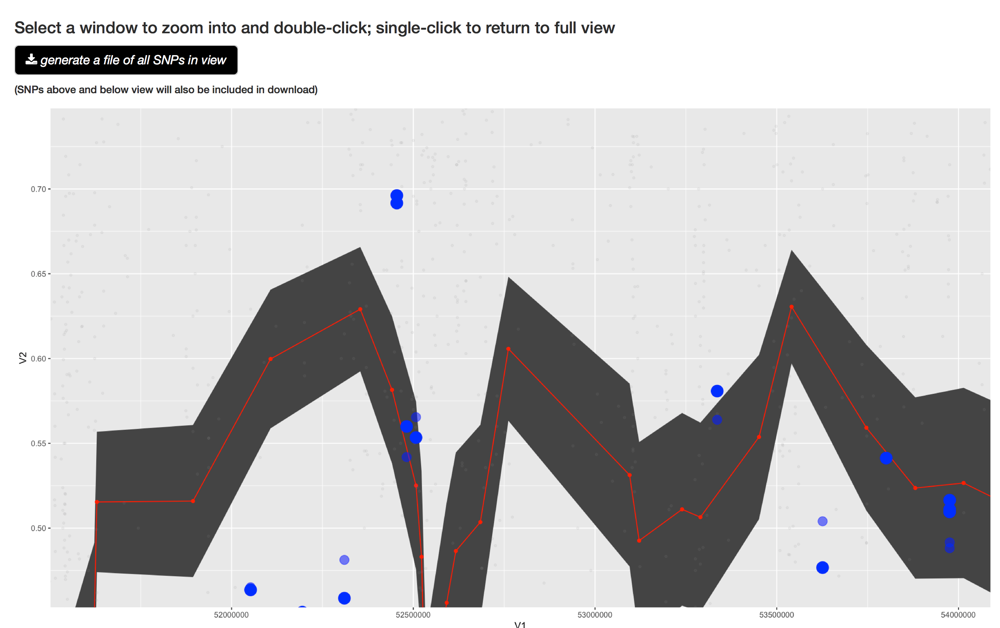

# QTLsurge
Software for iterative genotyping design in a QTL-seq experiment

## Installation and Implementation:

QTLsurge is designed to be run under RStudio as a Shiny app.  

0. Install dependancies RStudio then zoo, ggplot2, and shiny unless already installed
1. Download the R code: QTLsurge.R and vcf2freq.R
2. Open QTLsurge.R in RStudio
3. Press "Run App" button

## Required input

 QTLsurge requires a tab delimited file containing chromosome ID in the first column, SNP location in the second column, high-bulk allele frequency in the third column, low-bulk allele freqency in the fourth column, and absolute delta SNP (difference between high and low frequency) value in the fifth column.  Users may run the following pipeline or any tool/pipeline to generate the VCF file from their sequencing data. However, the AD tag should be present. It is not a default tag for most of tools. If you are not comfortable with commandline tools, you will want to collaborate with someone in order to generate the input format.  

```bash
#map reads to reference.fa using bwa or bowtie to generate highBulk.bam and lowBulk.bam
samtools faidx reference.fa #creates index
samtools mpileup -g -t AD -f reference.fa highBulk.bam lowBulk.bam > output.bcf #calls variants and adds fequency information
bcftools call -vc -V indels output.bcf > output_snps.bcf #filter to snps
#run desired filtration using bcftools
bcftools convert output_snps.bcf -o output_snps.vcf #convert to VCF
Rscript vcf2freq.R output_snps.vcf highBulk.bam lowBulk.bam frequency_file.txt 0 #vcf2freq.R is supplied as a helper program, converts to QTLsurge format.  The last argument is the cycle you are on.  Use 0 if this is your initial, standard QTL-seq experiment
```

A testing file (test/test.freq) is located on the github page.
 
## Running an experiment

You will start with low-depth (10-30x) sequencing data across the genome converted to QTLsurge format as described above.  Browse to this file and open it.  A graph, similiar to the one below will appear momentarily.  You can step through each chromosome using the interface and look for peaks that are above the genome-wide threshold (95th percentile based on raw deltaSNP values).  Because raw data of this kind is very noisy, a sliding window average is supplied.  The appropriate window size is a function of population size, recombination rate, marker density, and read depth.  Generally, if read depth is >40x, your window size should decrease as your population size increases.  A good rule-of-thumb is that few windows should have an average that extends beyond 3 standard error units of a directly adjacent window, assuming your overlap-to-window-size is ~20%.  The red line indicates the average of window and the gray shading iindicates 3 standard error units. Note: Setting the overlap size very low will cause QTLSurge to respond slowly and should only be used when zoomed in to a <1MB range. 
	

	
Once a peak is identified and selected, by zooming in, all SNPs in the zoomed area can be exported using the "generate . . . " button.  SNPs will also contain the sliding window average for the window size selected but with an overlap of 1 (every SNP is different).  This file, in conjunction with the VCF file and a genome browsing tool, can be used to design amplicons for border and peak SNPs as well as any number (2-30) intermediate SNPs depending on your ability to multiplex and sequencing platform.

Once these amplicons have been sequenced and QTLsurge files created, they can be loaded using the indicated field.  The raw results will fade and larger, blue points indicate the frequencies attained in amplicon cycles.  These results should allow you to zoom in further on the true peak and, by useing the zoom above, you can capture intervening SNPs.  The exported file will be sorted by position and tagged with the cycle (so some positions will have multiple entries).  Find your peak and borders for most recent cycle and design primers as above.
  
  
  
  After a second cycle, you will combine first and second cycle information together by copy and pasting in a text editor.  Use Notepad or Text Wrangler but not Word, and make sure to avoid pasting the header when adding to your previous cycle file. This file can now be loaded in the "amplicon ..." file field.  In theory, you can combine all files and load in the "initial QTL-seq" field, but this file is generally much larger and harder to work with, so we combine everything for you under-the-hood.
  
  Loading the combined 1st and 2nd cycle files will result in a new set of points.  The largest, darkest points are always the most recent.
  
  
  
  Continue cycling until you're confident you've found the true peak and its boundaries.  Depending on the experiment, this doesn't mean your gene is exactly there, but, with a little detective work or help from other tools (see [Gene Sieve](http://genemachine.net/pages/leapFrog.html)), you should be able to find a very strong candidate in the neighborhood.


## Citation:
coming soon
